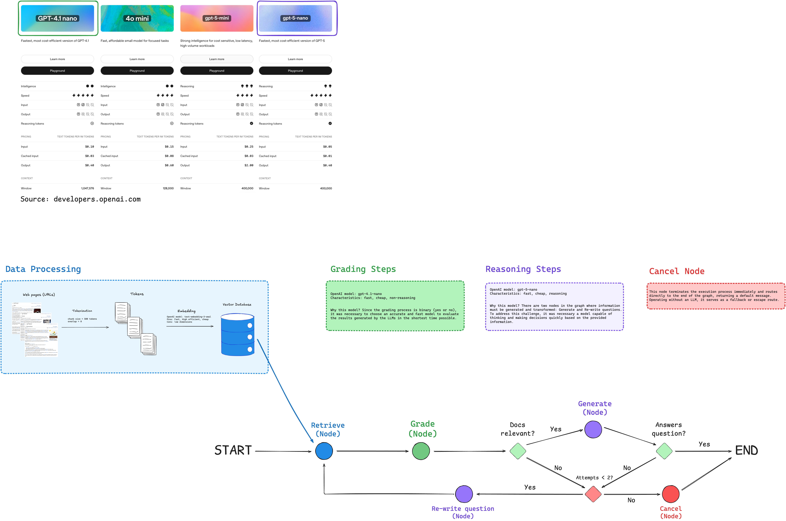

# LangMark

This repository contains several AI “agents” developed using LangChain and LangGraph.
Each “agent” listed here includes a visual representation of its structure and an explanation of the decisions it makes.

## 1. RAG Agent

